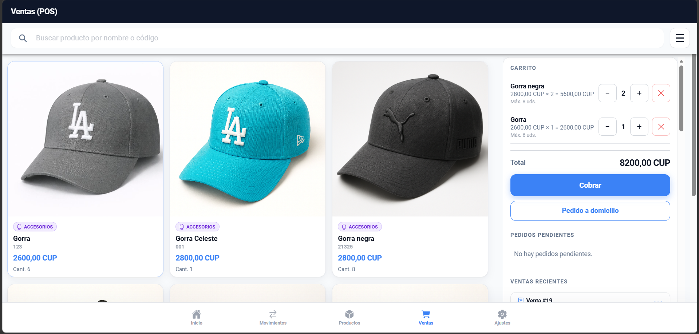

<h1 align="center">Ernesto Camps</h1>

  Remote-ready Developer • Python • Android (Kotlin) • AI Training

  

  

  

---

## 🚀 Sobre mí

- 🤖 Entreno modelos de Inteligencia Artificial
- 🐍 Desarrollo en Python
- 📱 Desarrollo Android con Kotlin
- 🌐 Desarrollo Web con TypeScript & React
- 🔥 Construyendo aplicaciones inteligentes

---

## 🛠️ Tech Stack

### 👨‍💻 Lenguajes

---
## 🎮 Juego Publicado en Google Play

  

### 🕹️ Impos2
IMPOS2 is a multiplayer social deduction game built with modern web technologies. Players receive secret roles, and one or more impostors must blend in without knowing the secret word. The game includes multiple modes: Manual, Semi-manual, Database, Football, Animals, Countries, Movies & Series, and Sports. Optimized for local group play on a single device.

  

- 🎯 Género:
- 🛠️ Tecnologías: Kotlin / Android Studio
- 🚀 Publicado oficialmente en Google Play
- 👥 Número de descargas (si quieres agregarlo)

# Caja & Gastos

Caja & Gastos es una aplicación móvil diseñada para ayudar a pequeños negocios y emprendedores a gestionar productos, ventas, pedidos, caja, gastos y estadísticas desde una sola herramienta.

  

## 📌 Estado del proyecto

Actualmente la app se encuentra en fase de **prueba cerrada en Google Play**.

## 🚀 Funcionalidades

### 🛒 Gestión de productos

- Agregar productos con foto
- Guardar nombre, código, categoría, precio y cantidad
- Editar o eliminar productos
- Controlar disponibilidad e inventario
- Detectar productos con poca cantidad o agotados

### 💰 Ventas rápidas

- Registrar ventas de forma sencilla
- Cobros en efectivo, transferencia o pago mixto
- Descuentos y ofertas manuales
- Cobro en otra moneda con tasa de cambio manual
- Confirmación y registro de ventas al instante

### 📦 Pedidos y reservas

- Crear pedidos a domicilio o reservados
- Guardar datos del cliente, dirección y hora de entrega
- Añadir costo de domicilio
- Editar pedidos antes de confirmar el cobro
- Confirmar o cancelar pedidos pendientes
- Compartir detalles del pedido por WhatsApp

### 🧾 Control de caja y movimientos

- Registrar ingresos y gastos manuales
- Controlar saldo de caja
- Ver entradas y salidas de dinero
- Diferenciar cobros en efectivo y transferencias
- Analizar dinero pendiente y movimientos del negocio

### 🏦 Cuentas para transferencias

- Guardar tarjetas o cuentas bancarias
- Seleccionar cuenta de cobro al recibir transferencias
- Mejorar el control de entrada de dinero

### 📊 Estadísticas del negocio

- Resumen general de ventas, gastos y caja
- Dinero invertido en el negocio
- Inversión por categorías
- Métodos de cobro
- Inventario y cantidades disponibles
- Ganancias y comportamiento de ventas

### ⚙️ Configuración

- Cambiar moneda principal
- Elegir idioma
- Configurar datos de la tienda
- Agregar logo e información de contacto
- Ver tutoriales y ayuda de uso
- Contactar soporte

## 🎯 Ideal para

- Pequeños negocios
- Emprendedores
- Tiendas locales
- Ventas informales
- Negocios que necesitan controlar productos, pedidos y dinero

## 🛠️ Tecnologías usadas

- Android
- Kotlin
- SQLite / Room
- Material Design
- Google Play Console

## 👨‍💻 Autor

Desarrollado por **Ernesto Camps**.

## 📌 Proyectos destacados

### 🎓 CRD Cliente Offline — Proyecto de tesis

Aplicación de escritorio offline para la gestión de hojas CRD.  
Desarrollada con Electron, React, JavaScript y SQLite, con soporte para importación y validación de archivos Excel.

**Tecnologías:** Electron · React · JavaScript · SQLite · xlsx  
**Repositorio:** [CRD-Cliente-OFFLINE](https://github.com/Campsito1569/CRD-Cliente-OFFLINE)

---

### 🌱 AgroAgua

Proyecto orientado a soluciones digitales aplicadas al área agrícola o gestión de recursos.

**Tecnologías:** TypeScript · React  
**Repositorio:** [AgroAgua](https://github.com/Campsito1569/AgroAgua)

---

### 🐍 Organizadoc

Proyecto desarrollado en Python para organización, automatización o gestión de documentos.

**Tecnologías:** Python  
**Repositorio:** [organizadoc](https://github.com/Campsito1569/organizadoc)

---

## 🔥 Racha de contribuciones

---

## 🚀 Objetivo 2026
Construir proyectos que integren:
- IA + Mobile
- Backend en Python
- Frontend moderno

---

## 📫 Contacto
📧 ernestocamps865@gmail.com
